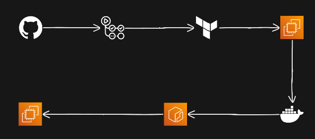

# FreshCart — Grocery App (DevOps Course Project)

A simple full-stack grocery storefront packaged as a Docker image and deployable to AWS using Terraform and GitHub Actions.

## Tech stack
- Node.js + Express (backend)
- Static frontend (HTML/CSS/JS)
- Docker for containerization
- AWS (ECR, EC2, IAM, Security Groups)
- Terraform for infrastructure
- GitHub Actions for CI/CD

## Repository layout

- `grocery-app/` — application source and Dockerfile
  - `server/` — Express server
  - `public/` — frontend files
- `terraform/` — Terraform configuration to provision ECR, EC2 and related resources
- `.github/workflows/deploy.yml` — GitHub Actions workflow to build, push and deploy the Docker image

## Prerequisites

- Node.js 18+ and npm
- Docker (for local build/run)
- Terraform 1.5+
- An AWS account with programmatic credentials
- (Optional) AWS CLI configured locally

Do NOT commit AWS credentials. Use `terraform/terraform.tfvars` or environment variables.

## Local development

1. Install dependencies and run the app locally (dev mode):

```bash
cd grocery-app
npm install
npm run dev
# open http://localhost:3000
```

2. Production-like container (build & run with Docker):

```bash
# from repo root
docker build -t freshcart_grocery-app:latest .
docker run -d --name grocery-app -p 3000:3000 freshcart_grocery-app:latest
# open http://localhost:3000
```

## CI/CD (GitHub Actions)

The workflow at `.github/workflows/deploy.yml` builds a Docker image, pushes it to ECR, and then uses AWS SSM to instruct EC2 instances (tagged `Name=grocery-app-web`) to pull and run the new image.

Required repository secrets:
- `AWS_ACCESS_KEY_ID`
- `AWS_SECRET_ACCESS_KEY`

On push to `main` (or manual dispatch) the pipeline will:
- Build and push `ECR_REPOSITORY` (set in the workflow)
- Send a SSM command to EC2 instances to pull and restart the container

## Build & push image manually (Optional, Only Run for testing OR Debugging)

```bash
# build
docker build -t $ECR_REGISTRY/$ECR_REPOSITORY:latest ./grocery-app
# login
aws ecr get-login-password --region $AWS_REGION | docker login --username AWS --password-stdin $ECR_REGISTRY
# push
docker push $ECR_REGISTRY/$ECR_REPOSITORY:latest
```


## Terraform (provisioning on AWS)

The `terraform/` configuration will create an ECR repository, an EC2 instance, IAM role/profile, and a security group. Required variables are defined in `terraform/variables.tf`.

Basic workflow:

```bash
cd terraform
terraform init
terraform plan -out plan.tfplan
# provide credentials via terraform.tfvars or export env vars
terraform apply "plan.tfplan"
terraform destroy # To end the running server and all the resources
```

Notes:
- Set `aws_access_key` and `aws_secret_key` in `terraform/terraform.tfvars`, or rely on your environment/credentials chain (recommended).
- The EC2 instance user data pulls the `latest` image from the ECR repo created by Terraform.


## Security & best-practices

- Never commit credentials. Add `terraform/terraform.tfvars` to `.gitignore` (if not already).
- Use least-privilege IAM policies for CI credentials.
- Lock down `allowed_cidr` in `terraform/variables.tf` to your IP range for production.

## Troubleshooting

- If the app fails to start locally, check `server/index.js` for the port (defaults to 3000).
- For Terraform errors, run `terraform validate` and check AWS limits/quota.
- For CI failures, verify GitHub secrets and IAM permissions.


---
